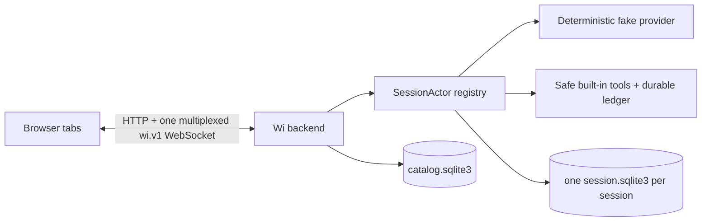

# Wi

Wi is a local, single-operating-system-user, Linux-only browser coding-agent harness. The browser is a disposable GUI; the Node.js backend owns sessions, runs, provider requests, approvals, tool execution, replay, and persistence.

This repository includes the `v0.1.0` vertical slice and v0.2 Milestone 11 provider-connection infrastructure. Milestone 11 remains strictly fake/no-network: it adds durable provider connection identity, credential stores, explicit future-run selection, immutable run pinning, lifecycle recovery, and browser management, but no OpenAI requests or OAuth. It still does **not** include live OpenAI integration, ChatGPT/Codex OAuth, `codex app-server`, real shell/filesystem mutation tools, plugins, remote hosting, or multi-user access.

## Requirements

- Linux
- Node.js 24 (`>=24 <25`)
- pnpm 11 (`>=11 <12`; the repository pins `11.11.0`)

The production entry fails fast on non-Linux systems; the install preflight rejects unsupported Node.js versions.

## Install and run

From a clean checkout:

```sh
npm install --global pnpm@11.11.0
pnpm install --frozen-lockfile
pnpm build
pnpm start
```

Open <http://127.0.0.1:4317/>. Wi serves the built browser application and its authenticated `wi.v1` WebSocket from the same loopback origin. Stop it with `Ctrl-C`/`SIGINT` or `SIGTERM`; shutdown is bounded and does not treat browser disconnection as run cancellation.

To stage a file-backed API key without placing it in shell arguments or browser storage, build first and run `pnpm credentials:provision` for masked TTY input. For an already-open descriptor, invoke the built Node entry point directly so a package-manager subprocess cannot reuse or close the descriptor: `node apps/server/dist/credential-cli.js --api-key-fd 3`. Paste only the returned one-time `provref_…` value into the provider connection panel.

For an ephemeral port:

```sh
WI_PORT=0 pnpm start
```

Read the JSON `server_started` log record for the selected port. Production always binds exactly to `127.0.0.1`; remote binding is not supported.

## Persistent data

`WI_HOME` defaults to `~/.wi`:

```text
$WI_HOME/
  catalog.sqlite3
  sessions/<prefix>/<session-id>/
    session.sqlite3
    artifacts/
  logs/
  tmp/
```

Production diagnostics are currently written as structured records to stdout; the root `logs/` directory is reserved storage layout, not the active log destination.

The per-session database is canonical. `catalog.sqlite3` is a rebuildable index used for bounded session listing and lookup. Session events are append-only, command acceptance is idempotent by `commandId`, and browser-visible durable events are published only after their session transaction commits.

Use a disposable home for experiments:

```sh
WI_HOME="$(mktemp -d)" pnpm start
```

Do not delete or replace live database, WAL, or SHM files. See [storage and migration operations](docs/reference/migrations.md) before backup or repair work.

## Configuration

The production environment variables are:

| Variable | Default | Accepted value |
|---|---:|---|
| `WI_HOME` | `~/.wi` | non-empty path |
| `WI_PORT` | `4317` | integer `0..65535` |
| `WI_SHUTDOWN_DEADLINE_MS` | `15000` | integer `100..120000` |
| `WI_SESSION_DISCOVERY_LIMIT` | `1000` | integer `1..10000` |
| `WI_CATALOG_REPAIR` | unset | exactly `1` to request explicit catalog reconstruction |

See [configuration and operational limits](docs/reference/operational-limits.md) for fixed protocol, replay, worker, and HTTP bounds.

## How the vertical slice works



- Tabs subscribe, send idempotent commands, and reduce committed events.
- Closing every tab never cancels backend work.
- Reconnection resumes from a session-local sequence cursor through a race-free replay barrier.
- Provider output remains provisional until terminal completion.
- Tool calls cannot execute from partial, failed, cancelled, or incomplete provider output.
- Approvals and pending inputs survive browser loss and backend restart.

See:

- [architecture overview](docs/architecture/v0.1-overview.md)
- [architecture diagrams](docs/architecture/diagrams.md)
- [browser protocol](docs/architecture/browser-protocol.md)
- [run state machine](docs/architecture/run-state-machine.md)
- [storage model](docs/architecture/storage-model.md)
- [failure and recovery matrix](docs/architecture/failure-recovery-matrix.md)
- [event catalog](docs/reference/event-catalog.md)

## Test commands

```sh
pnpm lint
pnpm typecheck
pnpm test:unit
pnpm test:integration
pnpm test:property
pnpm test:process
pnpm test:e2e
pnpm build
pnpm test:fuzz -- --duration=60s
pnpm check
```

`pnpm check` runs lint, typecheck, every Vitest workspace project, the build, and package-export verification. Browser E2E and the 60-second release fuzz profile remain explicit commands. CI runs deterministic checks and E2E as dependencies of the stable required check `CI / required`; extended fuzz runs nightly or manually.

See [test strategy](docs/testing/strategy.md) and [property/fuzz reproduction](docs/testing/fuzzing.md). The automated release scenario is `tests/e2e/milestone9-final-acceptance.spec.ts`.

## Security boundary

Wi trusts the local operating-system user and same-user processes. It is not an internet-facing or multi-user security boundary. The server binds to loopback, validates `Host` and WebSocket `Origin`, requires an HttpOnly local browser credential, keeps credentials out of browser storage and protocol payloads, and renders model/tool text as untrusted text.

Detailed diagnostics stay in bounded redacted server logs; browser errors receive safe text plus a `diagnosticId`. See [security model](docs/security.md).

## Operations and support

- [Troubleshooting](docs/troubleshooting.md)
- [Known limitations](docs/known-limitations.md)
- [Migration and repair guide](docs/reference/migrations.md)
- [Release-candidate checklist](docs/release-candidate-checklist.md)

No production session-export command or UI exists in this slice. Back up Wi only while stopped and include both the catalog and session directories; see the documented limitations before relying on a backup.

## Architecture decisions

[`docs/adr/README.md`](docs/adr/README.md) is the canonical ADR index. In particular, Wi has no fallback to `codex app-server` and will never silently switch provider, endpoint, account, model, transport, or billing source.
