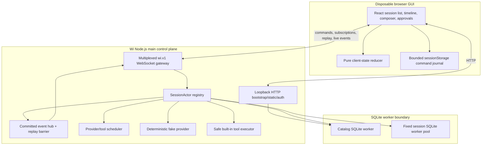
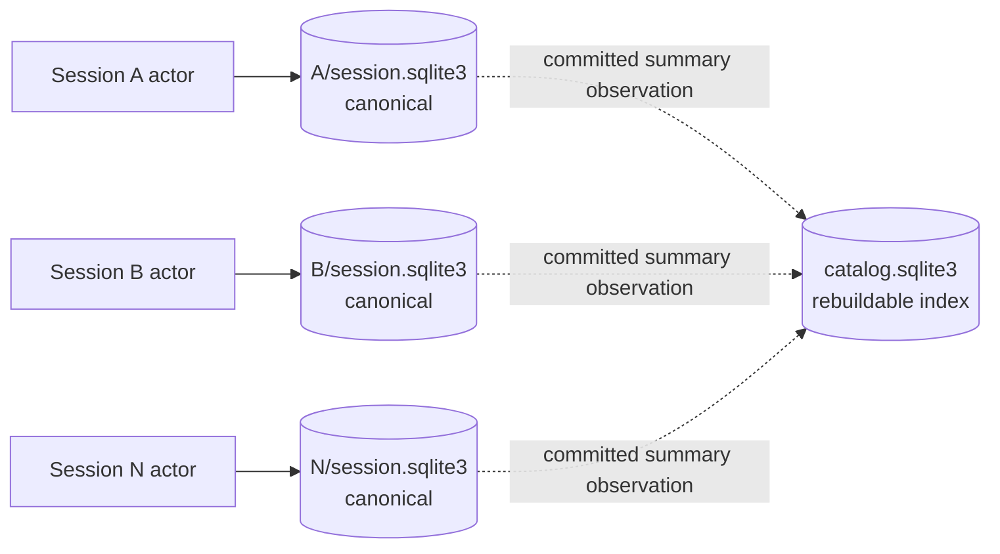
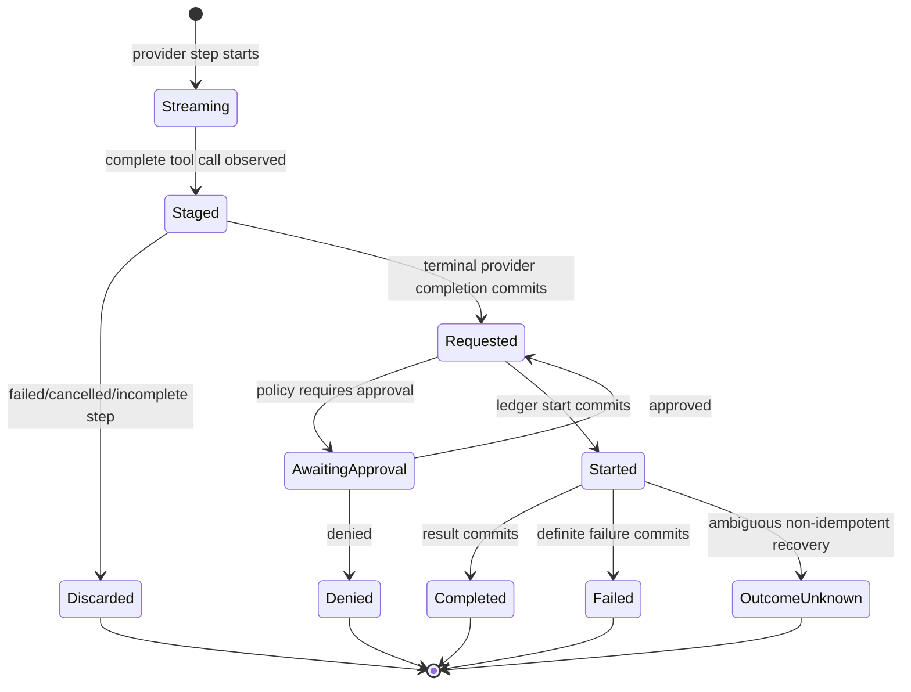
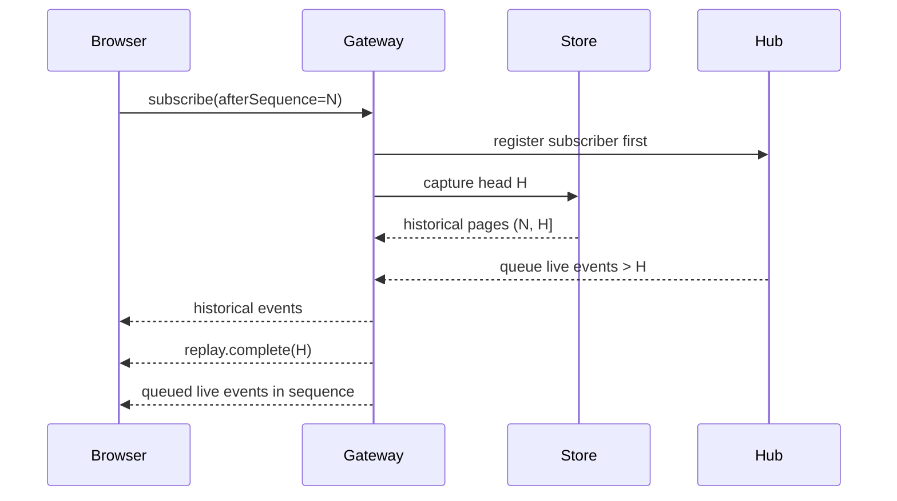

# Wi v0.1 architecture diagrams

These diagrams summarize the implemented first vertical slice. The canonical behavioral details remain in the linked architecture documents and ADRs.

## Runtime topology



Text equivalent:

```text
browser -> loopback HTTP + one wi.v1 WebSocket -> server control plane
server -> one catalog worker + fixed session worker pool
SessionActor -> fake provider + safe tools -> durable session ledger/events
committed events -> event hub/replay barrier -> every subscribed browser tab
```

The fake provider and safe built-in tool executor are current in-process components. Plugin hosts, real tool child processes, and project-service supervisors are deferred and intentionally absent from this topology.

## Persistence and ownership



A session commit never depends on an atomic cross-database transaction. The catalog may lag, but a session database remains canonical and can repair its catalog projection.

## Command and publication boundary

```mermaid
sequenceDiagram
  participant Browser
  participant WS as WebSocket gateway
  participant Actor as SessionActor
  participant DB as Session SQLite worker
  participant Hub as Event hub

  Browser->>WS: command(commandId, method, params)
  WS->>Actor: route validated command
  Actor->>DB: accept command + append events/projections
  DB-->>Actor: transaction committed
  Actor->>Hub: publish committed events
  Actor-->>WS: durable accepted result
  WS-->>Browser: command.accepted
  Hub-->>Browser: live event frames
```

Identical command retries return the original durable result. Reusing a command ID with different canonical content is a conflict.

## Provider and tool boundary



A staged call is non-executable. Promotion occurs only after valid provider-step completion has committed.

## Replay barrier



Matching duplicates around reconnect are tolerated. Sequence gaps, conflicting identities/content, and impossible reducer transitions are integrity failures rather than silently repaired state.

## Failure ownership

```text
bad frame             -> reject frame/connection
slow browser          -> disconnect browser; recover by replay
provider-step failure -> fail/interupt smallest run boundary; never execute staged tools
session DB failure    -> mark one session unavailable
session worker death  -> fail affected requests and replace only after termination is confirmed
catalog failure       -> block catalog-dependent startup/listing; preserve session evidence
fatal server failure  -> process exits; restart recovery reconciles canonical session state
```

See [failure boundaries](failure-boundaries.md) and the [failure/recovery matrix](failure-recovery-matrix.md).
